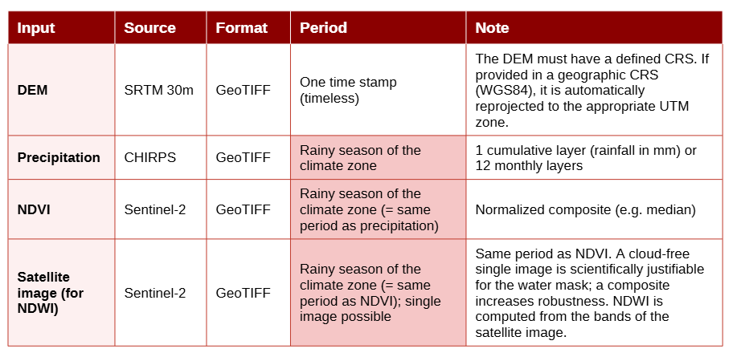
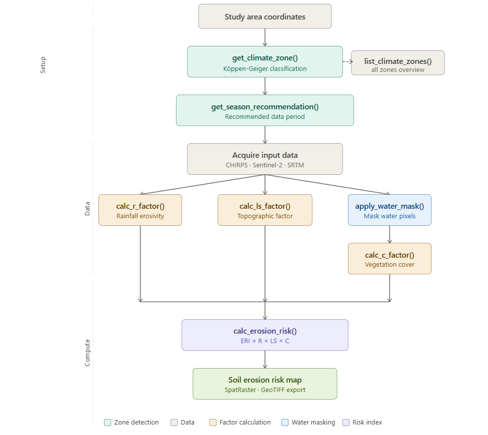
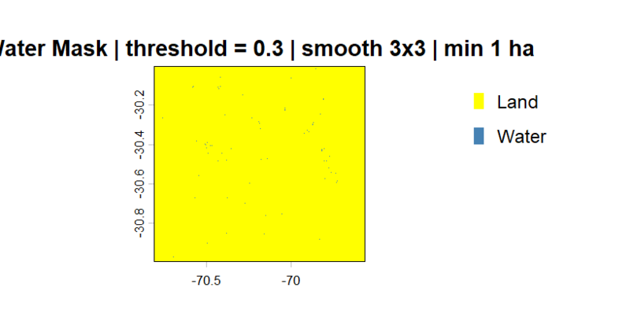
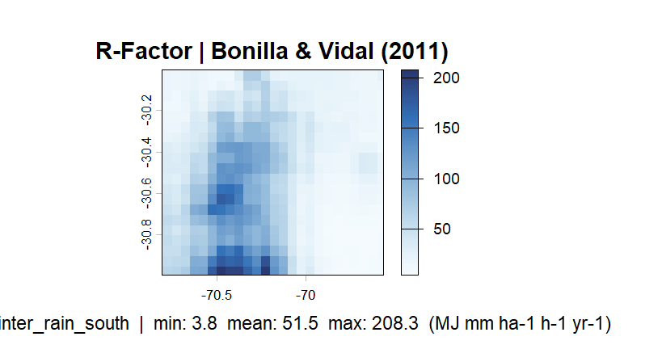
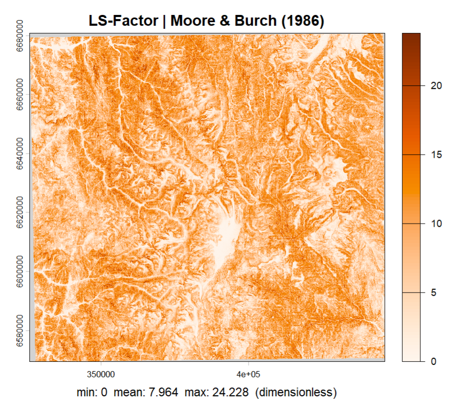
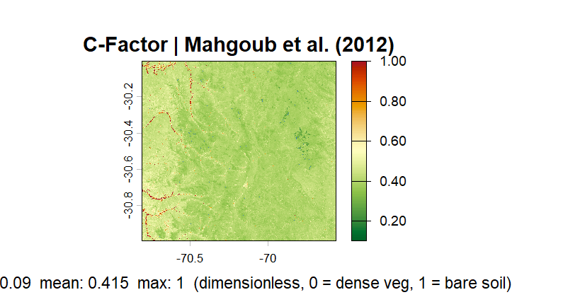
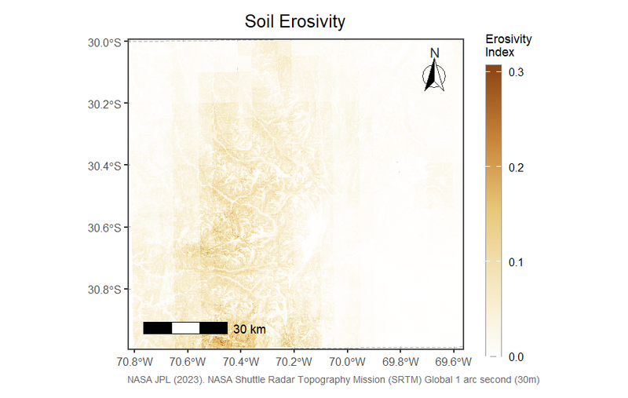

# aridRUSLE
aridRUSLE estimates soil erosion risk in semi-arid and arid regions worldwide by computing the three remotely-sensed RUSLE factors R, LS, and C from freely available satellite and climate data

## Overview
**aridRUSLE** is an R package implementing a modified RUSLE (Revised Universal
Soil Loss Equation) approach for soil erosion risk analysis in semi-arid and
arid regions worldwide. Rather than requiring all five classical RUSLE factors,
the package focuses on three key factors derivable from easily accessible
remote sensing and climate datasets: rainfall erosivity (R), topographic
influence (LS), and vegetation cover (C). Soil erodibility (K) and
conservation practices (P) are deliberately omitted due to typical data
limitations in semi-arid research areas.

To ensure accurate C-factor estimation, the package includes a dedicated
water masking step. Open water surfaces produce misleading NDVI values that
would otherwise bias the vegetation cover factor — applying
`apply_water_mask()` before `calc_c_factor()` removes these pixels and
prevents them from propagating into the final erosion risk index.

aridRUSLE is designed for global applicability across semi-arid and arid
climate regimes. The R-factor module supports five different empirical
formulas, each calibrated for a distinct regional climate. The appropriate
formula is automatically selected based on the geographic coordinates of
the study area using a Köppen-like climate zone classification, or can be
set manually. This makes the package readily applicable across the
Mediterranean, Sahel, Arabian Peninsula, Central Asia, Australia, and
South America without any manual formula lookup.
## Dependencies
aridRUSLE requires the following R packages, which are installed automatically:
`terra`, `ggplot2`, `tidyterra`, `ggspatial`, `kgc`

## Installation

```r
# install.packages("devtools")
devtools::install_github("sofiazaruchas/aridRUSLE")
```
## Data Requirements

The required input data are summarized in Table 1. The aggregation period 
for precipitation, NDVI, and satellite imagery (used for NDWI computation) 
depends on the climate zone of the study area and should correspond to the 
respective rainy season (see Table 2). The package automatically prints the 
recommended period at each call of `calc_r_factor()`.

</figure>

<figcaption>Table 1 – Required input datasets. Highlighted fields are climate-zone dependent</figcaption>
</figure>

## Workflow
<figure>
  
  <figcaption>Figure 1 – aridRUSLE workflow</figcaption>
</figure>

## Climate Zone Detection

Before selecting and downloading input data, it is recommended to first 
determine the climate zone of the study area. The zone controls which 
R-factor formula is applied and defines the correct aggregation period 
for precipitation, NDVI, and satellite imagery (Table 1).

```r
# Step 1: Get an overview of all supported climate zones
list_climate_zones()

# Step 2: Detect the climate zone from coordinates
get_climate_zone(lat = -30.5, lon = -70.2)

# Step 3: Get the recommended data period for that zone
get_season_recommendation("winter_rain_south")
```

The output of `get_season_recommendation()` directly defines the time 
window for which precipitation (CHIRPS), NDVI, and satellite imagery 
(Sentinel-2) should be acquired and aggregated.

## Water mask to mask out lakes
`apply_water_mask()` computes the Normalized Difference Water Index (NDWI)
internally from a multi-band satellite image and uses it to mask open water
pixels in a target raster such as an NDVI composite. It is a required
preprocessing step before `calc_c_factor()`, as water surfaces produce
misleading NDVI values. Optionally, a smoothing filter and a minimum patch
size threshold can be applied to remove isolated artefacts and retain only
true water bodies.

```r
sentinel  <- terra::rast("sentinel2.tif")
ndvi      <- terra::rast("ndvi.tif")

ndvi_masked <- apply_water_mask(
                 target_raster   = ndvi,
                 satelite_raster = sentinel,
                 green_band      = 3,       
                 nir_band        = 8,       
                 threshold       = 0.3,     
                 smooth          = TRUE,    
                 smooth_w        = 3,       
                 min_water_ha    = 1,       
                 return_ndwi     = FALSE,
                 plot            = TRUE
               )
```

<figure>
  
  <figcaption>Figure 2 – Water mask applied to the study area (threshold = 0.3, smooth 3x3, min 1 ha)</figcaption>
</figure>


## Region-specific Rainfall erosivity calculation (R-factor)
`calc_r_factor()` computes the RUSLE rainfall erosivity (R-factor) from a
precipitation raster using an empirical formula automatically selected for
the climate zone of the study area. The climate zone is detected from
geographic coordinates via a Köppen-Geiger classification, or can be set
manually. Five formulas are supported, each calibrated for a different
semi-arid or arid climate regime.

```r
precip <- terra::rast("chirps_seasonal.tif")

r_factor <- calc_r_factor(
              precip_raster = precip,
              lat           = -30.5,       
              lon           = -70.2,       
              climate_zone  = NULL,        
              season_days   = 243,         
              a             = 0.171,       
              b             = 1.212,       
              verbose       = TRUE,
              plot          = TRUE
            )
```

<figure>
  
  <figcaption>Figure 3 – R-factor map (Bonilla & Vidal, 2011). Zone: winter_rain_south</figcaption>
</figure>

## Calculation of topographic influence on erosion (LS-factor)
`calc_ls_factor()` computes the RUSLE topographic LS-factor from a digital
elevation model (DEM) using the Moore & Burch (1986) approach. The factor
combines slope length and slope steepness into a single dimensionless value
representing the topographic influence on soil erosion. If the DEM is
provided in a geographic CRS (WGS84), it is automatically reprojected to
the appropriate UTM zone before computation.

```r
dem <- terra::rast("srtm.tif")

ls_factor <- calc_ls_factor(
               dem     = dem,
               verbose = TRUE,
               plot    = TRUE
             )
```

<figure>
  
  <figcaption>Figure 4 – LS-factor map (Moore & Burch, 1986)</figcaption>
</figure>

## Calculation of vegetation cover influence of erosion (C-factor)
`calc_c_factor()` computes the RUSLE vegetation cover factor (C-factor) from
a water-masked NDVI composite using the exponential relationship of Mahgoub
et al. (2012). The C-factor ranges from 0 (dense vegetation, no erosion) to
1 (bare soil, maximum erosion). It is strongly recommended to apply
`apply_water_mask()` to the NDVI composite before passing it to this function.

```r
ndvi <- terra::rast("ndvi.tif")

# Step 1: mask water pixels first
ndvi_masked <- apply_water_mask(target_raster   = ndvi,
                                satelite_raster = sentinel)

# Step 2: compute C-factor from masked NDVI
c_factor <- calc_c_factor(
              ndvi_raster = ndvi_masked,
              verbose     = TRUE,
              plot        = TRUE
            )
```

<figure>
  
  <figcaption>Figure 5 – C-factor map (Mahgoub et al., 2012)</figcaption>
</figure>

## Erosion risk map
`calc_erosion_risk()` combines the R, LS, and C factors into a dimensionless
Erosion Risk Index (ERI) by normalising each factor to 0–1 and multiplying
them pixel-wise. If the input rasters do not share the same geometry, they
are automatically reprojected and resampled to match the LS-factor grid.
The result is displayed as a publication-quality cartographic map with a
north arrow, scale bar, and coordinate grid.

```r
result <- calc_erosion_risk(
            r_factor        = r_factor,
            ls_factor       = ls_factor,
            c_factor        = c_factor,
            normalize       = TRUE,
            resample_method = "bilinear",
            plot            = TRUE,
            map_title       = "Soil Erosivity",
            figure_caption  = NULL,
            data_source     = "NASA JPL (2023). SRTM Global 1 arc second (30m)"
          )
```

<figure>
  
  <figcaption>Figure 6 – Soil Erosion Risk Index (ERI = R × LS × C)</figcaption>
</figure>
