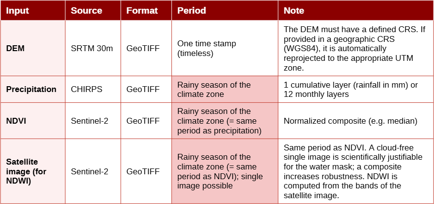
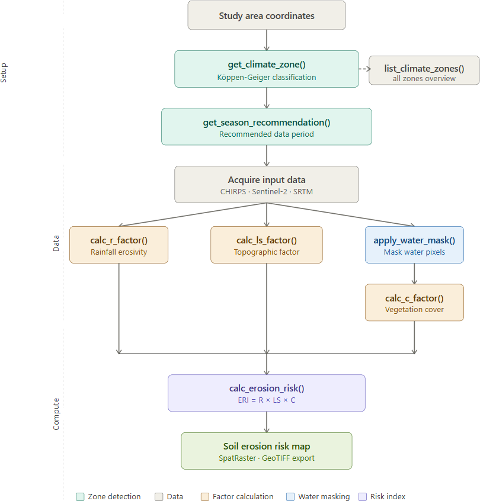
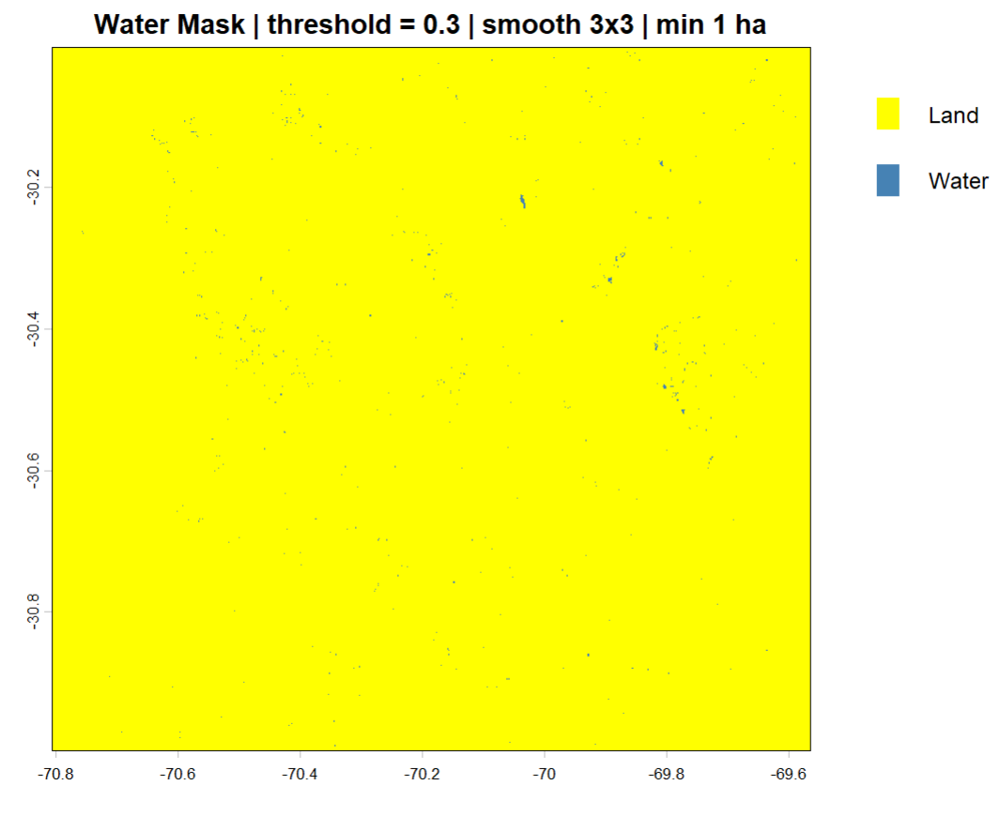
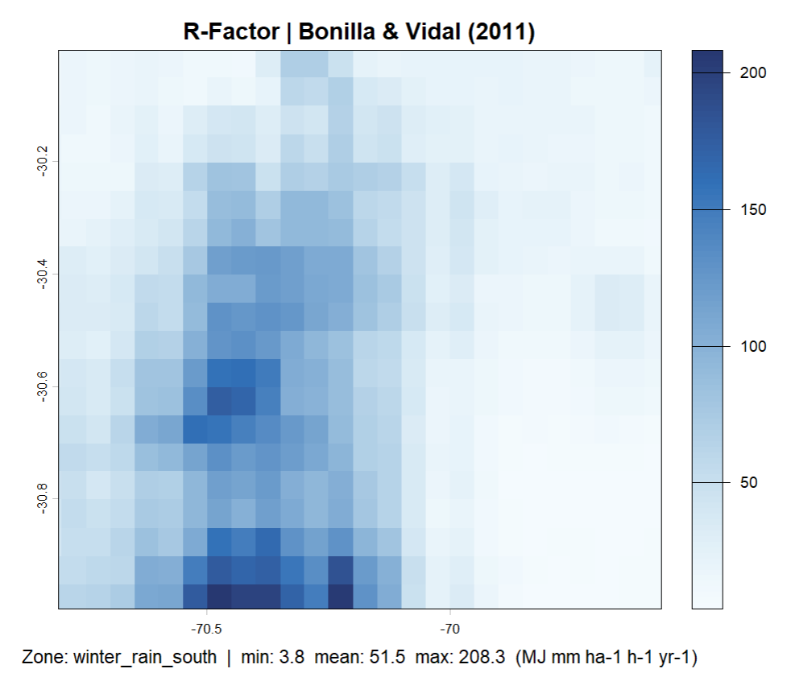
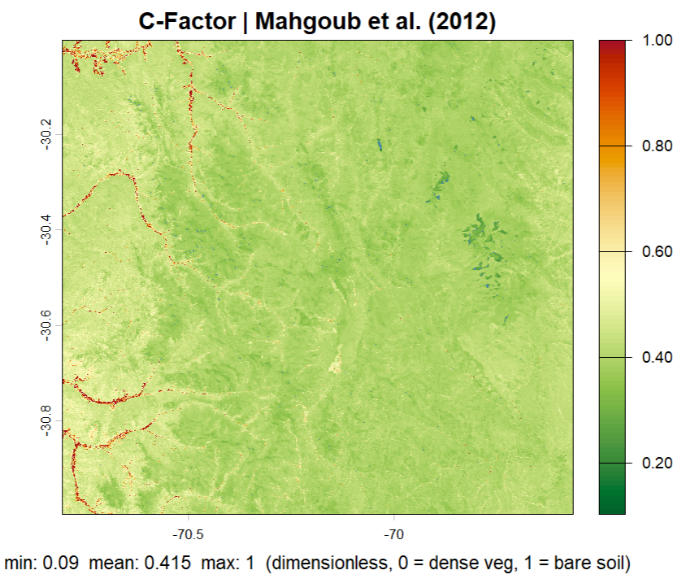
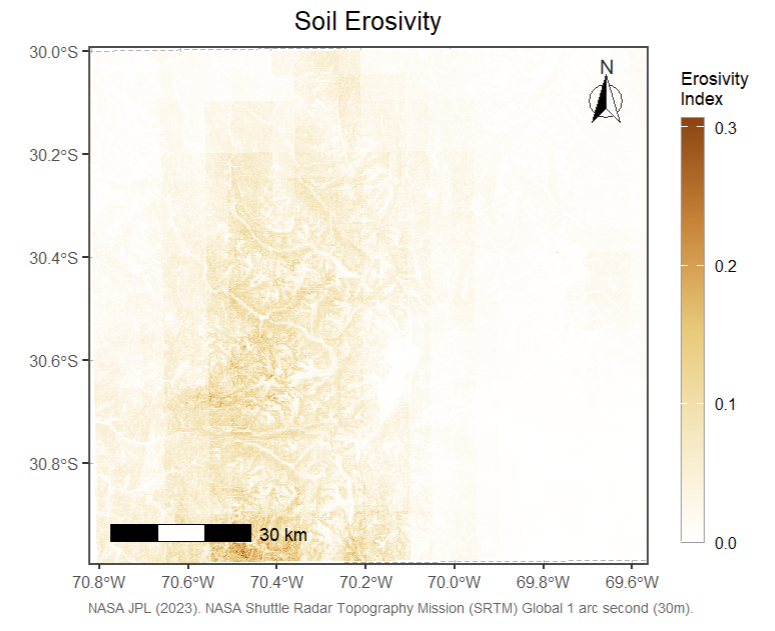

# aridRUSLE

aridRUSLE computes the three core RUSLE factors R, LS, and C from
satellite and climate datasets to estimate soil erosion risk in
semi-arid and arid regions worldwide.

## Overview

**aridRUSLE** is an R package implementing a modified RUSLE (Revised
Universal Soil Loss Equation) approach for soil erosion risk analysis in
semi-arid and arid regions worldwide. Rather than requiring all five
classical RUSLE factors, the package focuses on three key factors
derivable from easily accessible remote sensing and climate datasets:
rainfall erosivity (R), topographic influence (LS), and vegetation cover
(C). Soil erodibility (K) and conservation practices (P) are
deliberately omitted due to typical data limitations in semi-arid
research areas.

To ensure accurate C-factor estimation, the package includes a dedicated
water masking step. Open water surfaces produce misleading NDVI values
that would otherwise bias the vegetation cover factor, applying
[`apply_water_mask()`](https://sofiazaruchas.github.io/aridRUSLE/reference/apply_water_mask.md)
before
[`calc_c_factor()`](https://sofiazaruchas.github.io/aridRUSLE/reference/calc_c_factor.md)
removes these pixels and prevents them from propagating into the final
erosion risk index.

aridRUSLE is designed for global applicability across semi-arid and arid
climate regimes. The R-factor module supports five different empirical
formulas, each calibrated for a distinct regional climate. The
appropriate formula is automatically selected based on the geographic
coordinates of the study area using a Köppen-like climate zone
classification, or can be set manually. This makes the package readily
applicable across the Mediterranean, Sahel, Arabian Peninsula, Central
Asia, Australia, and South America without any manual formula lookup.

## Dependencies

aridRUSLE requires the following R packages, which are installed
automatically: `terra`, `ggplot2`, `tidyterra`, `ggspatial`, `kgc`,
`dplyr (>= 1.2.0)`

## Installation

``` r

# install.packages("devtools")
devtools::install_github("sofiazaruchas/aridRUSLE")
```

If `tidyterra` fails to load after installing aridRUSLE, update the
following packages and restart RStudio:

``` r

install.packages(c("rlang", "vctrs", "dplyr", "tidyterra"))
```

Then restart RStudio and reload:

``` r

library(aridRUSLE)
```

## Data Requirements

The required input data are summarized in Table 1. The aggregation
period for precipitation, NDVI, and satellite imagery (used for NDWI
computation) depends on the climate zone of the study area and should
correspond to the respective rainy season (see Table 2). The package
automatically prints the recommended period at each call of
[`calc_r_factor()`](https://sofiazaruchas.github.io/aridRUSLE/reference/calc_r_factor.md).



Table 1 – Required input datasets. Highlighted fields are climate-zone
dependent

## Workflow



Figure 1 – aridRUSLE workflow

## Climate Zone Detection

Before selecting and downloading input data, it is recommended to first
determine the climate zone of the study area. The zone controls which
R-factor formula is applied and defines the correct aggregation period
for precipitation, NDVI, and satellite imagery (Table 1).

``` r

# Step 1: Get an overview of all supported climate zones
list_climate_zones()

# Step 2: Detect the climate zone from coordinates
get_climate_zone(lat = -30.5, lon = -70.2)

# Step 3: Get the recommended data period for that zone
get_season_recommendation("winter_rain_south")
```

The output of
[`get_season_recommendation()`](https://sofiazaruchas.github.io/aridRUSLE/reference/get_season_recommendation.md)
directly defines the time window for which precipitation (CHIRPS), NDVI,
and satellite imagery (Sentinel-2) should be acquired and aggregated.

## Water mask to mask out lakes

[`apply_water_mask()`](https://sofiazaruchas.github.io/aridRUSLE/reference/apply_water_mask.md)
computes the Normalized Difference Water Index (NDWI) internally from a
multi-band satellite image and uses it to mask open water pixels in a
target raster such as an NDVI composite. It is a required preprocessing
step before
[`calc_c_factor()`](https://sofiazaruchas.github.io/aridRUSLE/reference/calc_c_factor.md),
as water surfaces produce misleading NDVI values. Optionally, a
smoothing filter and a minimum patch size threshold can be applied to
remove isolated artefacts and retain only true water bodies.

``` r

sentinel  <- terra::rast("sentinel2.tif")
ndvi      <- terra::rast("ndvi.tif")

ndvi_masked <- apply_water_mask(
                 target_raster   = ndvi,
                 satelite_raster = sentinel,
                 green_band      = 3,       
                 nir_band        = 8,       
                 threshold       = 0.3,     
                 smooth          = TRUE,    
                 smooth_w        = 3,       
                 min_water_ha    = 1,       
                 return_ndwi     = FALSE,
                 plot            = TRUE
               )
```



Figure 2 – Water mask applied to the study area (threshold = 0.3, smooth
3x3, min 1 ha)

## Region-specific Rainfall erosivity calculation (R-factor)

[`calc_r_factor()`](https://sofiazaruchas.github.io/aridRUSLE/reference/calc_r_factor.md)
computes the RUSLE rainfall erosivity (R-factor) from a precipitation
raster using an empirical formula automatically selected for the climate
zone of the study area. The climate zone is detected from geographic
coordinates via a Köppen-Geiger classification, or can be set manually.
Five formulas are supported, each calibrated for a different semi-arid
or arid climate regime.

``` r

precip <- terra::rast("chirps_seasonal.tif")

r_factor <- calc_r_factor(
              precip_raster = precip,
              lat           = -30.5,       
              lon           = -70.2,       
              climate_zone  = NULL,        
              season_days   = 243,         
              a             = 0.171,       
              b             = 1.212,       
              verbose       = TRUE,
              plot          = TRUE
            )
```



Figure 3 – R-factor map (Bonilla & Vidal, 2011). Zone: winter_rain_south

## Calculation of topographic influence on erosion (LS-factor)

[`calc_ls_factor()`](https://sofiazaruchas.github.io/aridRUSLE/reference/calc_ls_factor.md)
computes the RUSLE topographic LS-factor from a digital elevation model
(DEM) using the Moore & Burch (1986) approach. The factor combines slope
length and slope steepness into a single dimensionless value
representing the topographic influence on soil erosion. If the DEM is
provided in a geographic CRS (WGS84), it is automatically reprojected to
the appropriate UTM zone before computation.

``` r

dem <- terra::rast("srtm.tif")

ls_factor <- calc_ls_factor(
               dem     = dem,
               verbose = TRUE,
               plot    = TRUE
             )
```


Figure 4 – LS-factor map (Moore & Burch, 1986)

## Calculation of vegetation cover influence of erosion (C-factor)

[`calc_c_factor()`](https://sofiazaruchas.github.io/aridRUSLE/reference/calc_c_factor.md)
computes the RUSLE vegetation cover factor (C-factor) from a
water-masked NDVI composite using the exponential relationship of
Mahgoub et al. (2012). The C-factor ranges from 0 (dense vegetation, no
erosion) to 1 (bare soil, maximum erosion). It is strongly recommended
to apply
[`apply_water_mask()`](https://sofiazaruchas.github.io/aridRUSLE/reference/apply_water_mask.md)
to the NDVI composite before passing it to this function.

``` r

ndvi <- terra::rast("ndvi.tif")

# Step 1: mask water pixels first
ndvi_masked <- apply_water_mask(target_raster   = ndvi,
                                satelite_raster = sentinel)

# Step 2: compute C-factor from masked NDVI
c_factor <- calc_c_factor(
              ndvi_raster = ndvi_masked,
              verbose     = TRUE,
              plot        = TRUE
            )
```



Figure 5 – C-factor map (Mahgoub et al., 2012)

## Erosion risk map

[`calc_erosion_risk()`](https://sofiazaruchas.github.io/aridRUSLE/reference/calc_erosion_risk.md)
combines the R, LS, and C factors into a dimensionless Erosion Risk
Index (ERI) by normalising each factor to 0–1 and multiplying them
pixel-wise. If the input rasters do not share the same geometry, they
are automatically reprojected and resampled to match the LS-factor grid.
The result is displayed as a publication-quality cartographic map with a
north arrow, scale bar, and coordinate grid.

``` r

result <- calc_erosion_risk(
            r_factor        = r_factor,
            ls_factor       = ls_factor,
            c_factor        = c_factor,
            normalize       = TRUE,
            resample_method = "bilinear",
            plot            = TRUE,
            map_title       = "Soil Erosivity",
            figure_caption  = NULL,
            data_source     = "NASA JPL (2023). SRTM Global 1 arc second (30m)"
          )
```



Figure 6 – Soil Erosion Risk Index (ERI = R × LS × C)

## References

Arnoldus, H.M.J. (1980). An approximation of the rainfall factor in the
Universal Soil Loss Equation. In: De Boodt & Gabriels (eds.),
*Assessment of Erosion*. Wiley, 127-132.

Bonilla, C.A., & Vidal, K.L. (2011). Rainfall erosivity in central
Chile. *Journal of Hydrology*, 410(1-2), 126-133.

Mahgoub, M. et al. (2012). Estimation of soil loss from semi-arid area
using RUSLE model and remote sensing. *CATENA*, 100, 126-133.

McFeeters, S.K. (1996). The use of the Normalised Difference Water Index
(NDWI) in the delineation of open water features. *International Journal
of Remote Sensing*, 17(7), 1425-1432.

Moore, I.D., & Burch, G.J. (1986). Physical basis of the length-slope
factor in the Universal Soil Loss Equation. *Soil Science Society of
America Journal*, 50(5), 1294-1298.

Peel, M.C., Finlayson, B.L., & McMahon, T.A. (2007). Updated world map
of the Koeppen-Geiger climate classification. *Hydrology and Earth
System Sciences*, 11, 1633-1644.

Yu, B., & Rosewell, C.J. (1996). A robust estimator of the R-factor for
the Universal Soil Loss Equation. *Transactions of the ASAE*, 39(2),
559-561.
